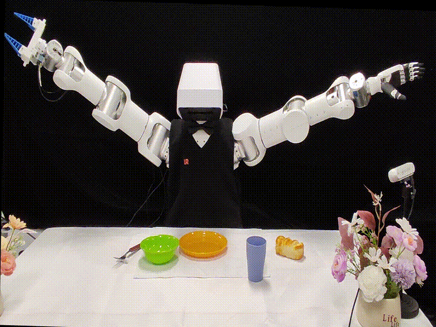
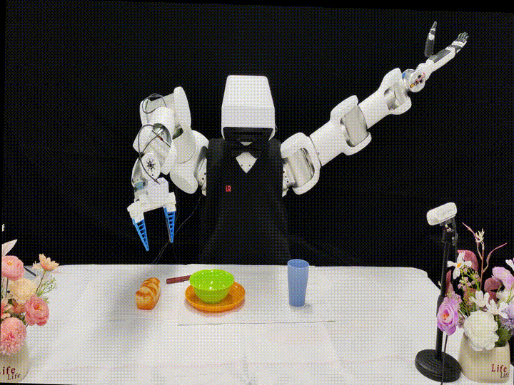

# Embodied AI on Dual Arm System V1

**Embodied Intelligence** refers to intelligent systems that possess a physical body and acquire intelligence through **perception, action, and interaction with the environment**.  
By tightly coupling embodiment with **Vision–Language Models (VLMs)**, robotic systems can understand high-level semantic instructions such as *“organize the workspace”* or *“assist a human operator”*, and autonomously decompose them into executable action sequences with coherent task-level planning.

This project presents a **Dual-Arm V1 embodied AI system** as a **demonstration-oriented interface**, showcasing how modern embodied intelligence paradigms can be integrated with dual-arm robotic manipulation platforms.

---

## Core Capabilities

Compared with traditional robotic control and task execution pipelines, embodied intelligence enables:

- **Long-horizon task planning**  
  High-level semantic commands are decomposed into structured multi-step action sequences, enabling coherent planning over long temporal horizons.

- **Online adaptability**  
  The system continuously perceives environmental changes and dynamically adjusts strategies during execution, ensuring robust and stable behavior in unstructured settings.

- **Semantic reasoning and embodied decision-making**  
  Through deep integration with large-scale vision–language models and multimodal perception, the system achieves semantic understanding, reasoning, and decision-making grounded in physical interaction.

These capabilities support reliable task execution in real-world scenarios such as **service robotics, logistics, and advanced manufacturing**.

---

## Two Parallel Pipelines: VLM and VLA

This project features **two parallel and complementary embodied intelligence pipelines**, designed for demonstration, comparison, and conceptual exploration.

### 1. Vision–Language Model (VLM) Pipeline

The **VLM pipeline** focuses on **long-horizon, semantically guided tasks**, such as **desktop organization**.

High-level language instructions are interpreted and decomposed into multi-step task plans, which are then executed through structured manipulation skills on the dual-arm platform.  
This pipeline emphasizes **semantic understanding, task decomposition, and interpretable planning**.

---

### 2. Vision–Language–Action (VLA) Pipeline

The **VLA pipeline** targets **dynamic object manipulation**, such as **real-time object grasping and interaction**.

By tightly coupling perception, language, and action generation, this pipeline enables more direct and reactive behaviors, highlighting the potential of end-to-end embodied policies in dynamic environments.

---

## Application Scenarios

The demonstrated embodied intelligence framework targets scenarios including:

- Dual-arm object manipulation and coordination  
- Semantically guided task execution  
- Human-centered service and assistance  
- Complex manipulation in unstructured environments

---
